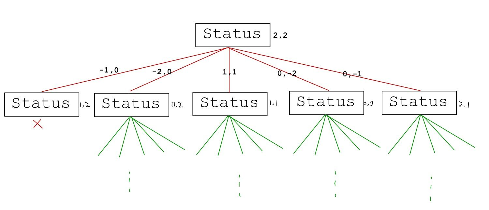

# 数学建模第一次作业

## 一、摘要

本文主要研究多个商人安全过河问题，通过回溯分析模型和无向图结构模型对问题建立模型，对问题进行求解。
安全过河问题可以视作一个多步决策过程，每一步，即船由北岸驶向南岸或从南岸驶回北岸，都要对船上人员作出决策，在保证安全的前提下，在有限步内使全部人员都到达北岸。本文两个模型均通过状态表示商人和随从的数量，决策船上人员情况，在题目允许的条件范围内，确定每一步决策，达到渡河的目标。


## 二、背景
三名商人各带一个随从乘船渡河。一小船只能容纳二人，由他们自己划行。随从们密约, 在河的任一岸, 一旦随从的人数比商人多, 就杀人越货。不过如何乘船渡河的大权由商人们掌握。商人们怎样才能安全过河呢?

由著名的三个商人过河的问题可以引申到多个商人过河的问题，即n个商人和m个随从过河，如何使商人们能够安全过河。


## 三、模型假设


#### 提出假设

1. 商人和仆人从南岸出发，目的地是北岸
2. 每个商人和随从都会划船
3. 只有一条船，且每条船最多乘坐两个人
4. 不管决策如何，商人或者仆人都需要先到岸再派个人上岸回程


#### 符号说明

`CurrentStatus.x`:表示某次运送前南岸商人的人数

`CurrentStatus.y`:表示某次运送前南岸仆人的人数

`N`:表示共有N对商人仆人


## 四、模型建立

### 模型：回溯分析

回溯模型即使用暴力的解法，一个状态接着一个状态的遍历，若当前状态不符合商人存活的条件，则回溯到上一个能使商人存活的状态。

每个状态Status有两个值即$x​$(商人数量)和$y​$(随从数量)。

每次状态变化之后都有:

1. 在河的南岸要保证商人存活且不存在有负数个人数的情况，保证如下南岸商人存活的等式:

   $CurrentStatus.x \ge 0 \and CurrentStatus.y \ge 0​$

   $(CurrentStatus.x\ge CurrentStatus.y \and CurentStatus.x \neq 0 )\or (CurrentStatus.x = 0)​$

2. 同时在河的北岸也要保证商人存活且不存在负数个人数的情况，保证如下北岸商人存活的等式:

   $N-CurrentStatus.x \ge 0 \and N-CurrentStatus.y \ge0 ​$ 

   $((N-CurrentStatus.x \ge N-CurrentStatus.y) \and N-CurrentStatus.x \neq 0) \or (N-CurrentStatus.x = 0))​$

3. 每次一个方向上有五种变化选择,为向对面方向输送$(x,y)​$个人:

   $(0,1),(1,0),(2,0),(1,1),(0,2)​$


利用了C++中完善的STL库实现了这个模拟：


**1.设置初始状态类**，并且重载这个类的运算符同时建立这个类的构造函数。

这个状态可以表示在南岸/北岸的商人和随从的人数，和转移的人数。

如在南岸的人数为[2,3]，表示南岸有2个商人和3个随从。

小船转移人数为[1,1]，表示船上有1个商人和1个随从。

```cpp
struct Status{
    int x,y;
    Status operator+(const Status s) {
		return { x + s.x,y + s.y };
	}
	Status operator-(const Status s) {
		return { x - s.x,y - s.y };
	}
	Status(const int _x, const int _y):x(_x), y(_y){};
}
```

同时小船状态的转移共有五种可能:

即

$$ Status=\left\{
\begin{aligned}
 & [1,0],[2,0],[1,1],[0,1],[0,2](MovingSouth) \\
 & [-1,0],[-2,0],[-1,-1],[0,-1],[0,-2](MovingNorth)
\end{aligned}
\right.  ​$$


**2.有个判断方向的布尔值，根据状态变化而变化**

```cpp
bool isMovingNorth;
```

若布尔值为true则表示小船往北，若布尔值为false则说明小船正在往南。


**3.利用栈数据结构记录路径和递归寻找正确路径**

首先自定义了一个`Stack`，与STL库自带的Stack不同的地方在于，自定义的Stack新增了方法`void showPath()`，表示从底部到顶部输出栈的内容。

```cpp
class PathStack {
public:
	PathStack() {
		ll.clear();
	}
	void push(Status s) {
		ll.push_back(s);
	}
	void pop() {
		ll.pop_back();
	}
	void showPath() {
		for (Status s : ll) {
			printf("(%d,%d)\n");
		}
	}
private:
	vector<Status>ll;
};
```

递归寻找路径，当遇到过河不成功的结果，则返回。下图为初始南岸为[2,2]的例子，从初始状态开始，第一次过河状态变化为[-1,0]，现在南岸的人数为[1,2]，北岸的人数[0,1]




类似树的中序遍历或者图的BFS，模型使用了递归方法寻找结果。

```cpp
void CrossRiver(Status cur,bool isMovingNorth) {
	if (cur.x == 0 && cur.y == 0) {
		PathIsFound = true;
		printf("Found it and the move status are below:\n");
		path.showPath();
		system("pause");
	}
	// it meet the demand and never happen before
	if (status_mark.find(cur) == status_mark.end()&&cur.x>=cur.y&&N-cur.x>=N-cur.y&&cur.x>=0&&cur.y>=0&&cur.x) {
		status_mark.insert(cur);
		path.push(cur);
		if (isMovingNorth) {
			int i;
			for (i = 0; i < 5; i++) {
				CrossRiver(cur + MoveNorth[i], !isMovingNorth);
			}
			if (!PathIsFound)path.pop();
		}
		else {
			int i;
			for (i = 0; i < 5; i++) {
				CrossRiver(cur + MoveSouth[i], isMovingNorth);
			}
			if (!PathIsFound)path.pop();

		}
	}
}
```

回溯方法相对直观，利用了计算机强大的计算能力。但是当遇到数量比较多的商人对的时候非常不方便模拟。于是我们在回溯模型上进行了优化，得出下面的无向图结构模型。此外，由运行结果发现，到N=12时，不存在能够安全渡河的解法。


### 模型：无向图结构模型


**建模思路**

| 概念模型                                       | 逻辑模型                          | 抽象模型                       |
| ---------------------------------------------- | --------------------------------- | ------------------------------ |
| 北岸人数与运送人数的方案（由条件检查确保可行） | 二维向量grid的索引，before，after | 无向图结构中的点               |
| 运送方案                                       | 二维向量`grid[before][after]`     | 无向图结构中的边               |
| 可运送的商人与仆人人数组合                     | 两个一维向量，cmer，cser          | 无向图结构中边上允许的流量流动 |


​                                                                          **模型中的逻辑结构**


1. 使用二维向量state 和 grid 的数据结构（以商人数量3为例）

| 仆人 \| 商人 | 0    | 1    | 2    | 3    |
| ------------ | ---- | ---- | ---- | ---- |
| 0            | 1    | 0    | 0    | 1    |
| 1            | 1    | 1    | 0    | 1    |
| 2            | 1    | 0    | 1    | 1    |
| 3            | 1    | 0    | 0    | 1    |

​										表1：二维向量state

布尔值二维向量state，描述北岸（出发岸）商人和仆人人数的可行解，如：商人1人，仆人1人，可行表示为1；如：商人2人，仆人1人，则对岸商人1人，仆人两人，不满足条件，不可行表示为0。

| 0    | 0    | 0    | 0    |
| ---- | ---- | ---- | ---- |
| 0    | 0    | 0    | 0    |
| 0    | 0    | 0    | 0    |
| 0    | 0    | 0    | 0    |

​                                                                               表2：二维向量grid

布尔值二维向量grid，描述北岸（出发岸）人数与运走人数之间的方案（可行性由条件判断确定），即**无向图结构的邻接矩阵**，如向量值`grid[before][after] == grid[after][before] == 1`,则证明已访问过图中该点。

当满足上述的三条条件之后，标记这一点已经被访问过，也就是当前这种出发人数与运走人数的状态已经被访问（加入到了运送方案中），再递归调用这一点的邻接节点。


2. 使用一维向量`cmer`,`cser`表示允许的可转移集合，即，每次可运送的人数，由两个向量的index匹配，如`cmer[0]`,`cser[0]`表示一次允许的可转移集合，可转移两个商人和0个仆人（满足运送要求）

   ```java
   int cmer[5] = { 2, 1, 0, 1, 0 };
   int cser[5] = { 0, 1, 2, 0, 1 };
   ```

   

3. 使用一维向量`mstep`,`sstep`记录每次的运送情况，程序最后输出这两个向量中的内容即可得到运送方案

   ```java
   int mstep[maxn*maxn];
   int sstep[maxn*maxn];
   ```

   

4. 使用布尔值`dir`表示运送的方向，按照假设，`dir = true`, 表示从北岸运送到南岸，`dir = false`,表示从南岸运送到北岸

   ```cpp
   bool dir = false;
   ```

   

5. 运用算法：深度优先搜索遍历二维向量grid,即无向图结构的邻接矩阵，根据运送方向的不同分类讨论

   （1）递归出口：已经到达最终状态，即北岸的商人和仆人的人数都是0

   输出`mstep`，`sstep`向量中保存的运送方案

   （2）按运送方向分类讨论

   其中，变量`before`索引到此次运送之前的商人仆人的人数情况

   变量`after`索引到此次运送之后的商人仆人的人数情况

   变量`before`,`after`共同索引到无向图中的可行方案


## 五、优点和缺点


### 回溯分析模型优缺点分析

### 优点

    1. 建模过程思路清晰，更容易入手。所得模型更加直观易懂。
    2. 确保模型遍历了整个过程，可以满足对任意一种状态的集中观察和输出。
    3. 便于观察变量对整个过程带来的影响。
    4. 通过C++程序，证明了模型的全面性

### 缺点

1. 当变量（商人、仆人人数）过大时，时间成本太高，输出结果过于繁杂，输出大量目标结论以外的不必要信息。

2. 没有找到仆人和商人之间的数量关系，只能用于判断是否能够成功过河，但没有发现过河的规律。


### 无向图结构模型优缺点分析

### 优点

1. 抽象模型深层更深，更集中于问题的本质，模型更加优美
2. 时间复杂度较低，减少不不必要状态的遍历，对更复杂的问题具有良好的适应性，能够轻松解决更复杂的数据量
3. 以无向图为状态映射，可以从侧面直观看出某一种状态之间的可能关系和转移结果

### 缺点

模型更加抽象，在建模阶段可能较为复杂，不易思考，不利于观察较小数量级下的每一种状态。


### 优缺点分析总结

从模型方法来说，回溯分析模型较为简单易懂，但也存在模型臃肿冗余的问题；无向图结构模型相对更加抽象复杂，但无疑模型更加优美，在数据量较大的情况下是上佳之选。对于本次讨论主题，3个商人和3个仆人的情况下，两种模型的差距较小。


###模型的推广

“商人过河”存在着许多不同的形式，比如“传教士与野蛮人过河”，“印度夫妻过河”等。我们完全可以按照商人过河的问题建立多步决策模型，将上述算法修改则可以得到它的解。用一定容积的若干油瓶倒出一定量的油的问题也属于此类问题。 


## 附录

回溯解法C++代码

```cpp
#include<cstdio>
#include<vector>
#include<unordered_set>
using namespace std;
struct Status {
	int x, y;
	Status operator+(const Status s) {
		return { x + s.x,y + s.y };
	}
	Status operator-(const Status s) {
		return { x - s.x,y - s.y };
	}
	Status(const int _x, const int _y):x(_x), y(_y){};
};


class PathStack {
public:
	PathStack() {
		ll.clear();
	}
	void push(Status s) {
		ll.push_back(s);
	}
	void pop() {
		ll.pop_back();
	}
	void showPath() {
		for (Status s : ll) {
			printf("(%d,%d)\n");
		}
	}
private:
	vector<Status>ll;
};
// record the direction
const static Status MoveNorth[5] = { {-1,0},{-1,-1},{-2,0},{0,-1},{0,-2} };
const static Status MoveSouth[5] = { {1,0},{1,1},{2,0},{0,1},{0,2} };
// record the correct path
PathStack path;
// record the status and construct a hash function
bool operator==(const Status& s1, const Status& s2) {
	return s1.x == s2.x&&s1.y == s2.y;
}
struct StatusHash {
	size_t operator()(const Status& _s)const {
		return hash<int>()(10 * _s.x + _s.y);
	}
};
unordered_set<Status,StatusHash>status_mark;


// the number of the bussinessman and the servant
int N;
bool PathIsFound = false;
void CrossRiver(Status cur,bool isMovingNorth) {
	if (cur.x == 0 && cur.y == 0) {
		PathIsFound = true;
		printf("Found it and the move status are below:\n");
		path.showPath();
		system("pause");
	}
	// it meet the demand and never happen before
	if (status_mark.find(cur) == status_mark.end()&&cur.x>=cur.y&&N-cur.x>=N-cur.y&&cur.x>=0&&cur.y>=0&&cur.x) {
		status_mark.insert(cur);
		path.push(cur);
		if (isMovingNorth) {
			int i;
			for (i = 0; i < 5; i++) {
				CrossRiver(cur + MoveNorth[i], !isMovingNorth);
			}
			if (!PathIsFound)path.pop();
		}
		else {
			int i;
			for (i = 0; i < 5; i++) {
				CrossRiver(cur + MoveSouth[i], isMovingNorth);
			}
			if (!PathIsFound)path.pop();

		}
	}
}

int main() {
	printf("Input the number of bussinessmans and the servants:\n");
	scanf("%d", &N);
	path = *(new PathStack());
	Status current = { N,N };
	CrossRiver(current, true);
	printf("Not found!\n");
	return 0;
}
```

图模型代码
```cpp
#include <cstdio>
#include<iostream>
#define maxn 100

using namespace std;
int num;
int grid[maxn*maxn][maxn*maxn];
int state[maxn][maxn];

int cmer[5] = { 2, 1, 0, 1, 0 };
int cser[5] = { 0, 1, 2, 0, 1 };
int mstep[maxn*maxn];
int sstep[maxn*maxn];


bool flag = false;
void DFS(int mer, int ser, int step, int dir)
{
	mstep[step] = mer, sstep[step] = ser;
	if (mer == 0 && ser == 0)
	{
		for (int i = 0; i <= step; i++)
		{
			printf("(%d,%d)", mstep[i], sstep[i]);
			if (i != step)
				printf(" -> ");
		}
		printf("\n");
		flag = true;
	}
	int before = mer * (num + 1) + ser;
	for (int i = 0; i < 5; i++)
	{
		if (dir) {
			int mnext = mer - cmer[i], snext = ser - cser[i];
			if (mnext >= 0 && mnext < num + 1 && snext >= 0 && snext < num + 1 && state[mnext][snext])
			{
				int after = mnext * (num + 1) + snext;
				if (!grid[before][after] && !grid[after][before])
				{
					grid[before][after] = 1;
					grid[after][before] = 1;
					DFS(mnext, snext, step + 1, !dir);
					grid[before][after] = 0;
					grid[before][after] = 0;
				}
			}
		}
		else {
			int mnext = mer + cmer[i], snext = ser + cser[i];
			if (mnext >= 0 && mnext < num + 1 && snext >= 0 && snext < num + 1 && state[mnext][snext])
			{
				int after = mnext * (num + 1) + snext;
				if (!grid[before][after] && !grid[after][before])
				{
					grid[before][after] = 1;
					grid[after][before] = 1;
					DFS(mnext, snext, step + 1, !dir);
					grid[before][after] = 0;
					grid[before][after] = 0;
				}
			}
		}
	}
}
int main()
{
	cin >> num;
	for (int i = 0; i < num + 1; i++)
	{
		state[i][0] = 1;
		state[i][num] = 1;
		state[i][i] = 1;
	}
	DFS(num, num, 0, 1);
	if (!flag)
		printf("they can't cross the river.");
}
```

